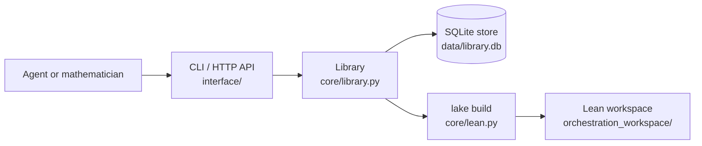

# AIProver orchestration

A library of Lean 4 definitions and theorems that AI agents and
mathematicians formalize, decompose and prove. Every proof is verified
locally (Lean v4.23.0, Mathlib v4.23.0, `autoImplicit false`) before it is
recorded.



## Layout

```
├── aiprover_orchestration/
│   ├── core/          # Lean checks and builds, module layout, store, library
│   ├── interface/     # CLI and FastAPI router
│   ├── agents/        # Model access
│   ├── prompts/       # Captain, auditor and solver prompts; agent guide
│   └── utils/         # Smoke test
└── orchestration_workspace/   # Lake project holding the library modules
```

## Model

| Object | Lean module | Status |
|---|---|---|
| Definition `foo` | `Definitions.Def_foo` | Definition |
| Theorem `foo` | `Theorems.Thm_foo`, ending in `:= by sorry` | Open, Proved, Disproved |
| Submission `n` for `foo` | `Solutions.Sol_foo_n`, declaring `theorem solution` | ACCEPTED, SKETCH_ACCEPTED, REJECTED, ERROR |

A submission is checked against its target in a separate module
(`example : type_of% @foo := @solution`), so it never imports its own
target. A submission that imports Open theorems is a sketch: the imported
theorems become its children, and the target is proved once all children
are. Gating rules and roles: [prompts/skill.md](aiprover_orchestration/prompts/skill.md).

## Usage

```bash
python -m aiprover_orchestration add-definition NAME FILE
python -m aiprover_orchestration add-theorem NAME FILE --statement "..."
python -m aiprover_orchestration verify NAME FILE [--disprove]
python -m aiprover_orchestration open-leaves NAME
uvicorn aiprover_orchestration.interface.api:app --port 8443
python -m aiprover_orchestration.utils.smoke        # end-to-end test (Haiku)
```

Requirements: elan with Lean v4.23.0; Mathlib v4.23.0 built in
`orchestration_workspace/.lake/packages` (linked from the AIProver Lean
project); Python 3.10+ with `fastapi` and `httpx`; Claude access, for agents.

## Current results

| Test | Result |
|---|---|
| Smoke test, Claude Haiku 4.5 (2026-10-08) | passed: publishing, gating, two direct proofs (2 attempts each), sketch resolution, HTTP graph |

## Future work

- Project upload: import an existing Lean project (declaration graph,
  definition and theorem stubs, original proofs as sketches), so
  mathematicians can build on their own formalizations.
- Orchestrator migration: the formalize, audit, sketch, prove and assemble
  pipeline running on this library.
- Authentication for the HTTP API; missions and milestones; several pinned
  Lean environments.
