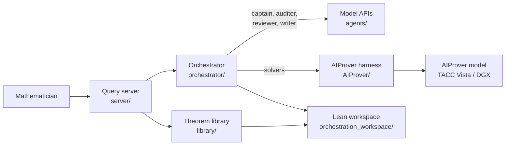

# AIProver orchestration

Tools for mathematicians to direct AI agents at their problems in Lean 4. An
orchestrator formalizes a problem, has the formalization audited blind,
decomposes the proof into lemmas and proves them with Claude and the AIProver
model; a theorem library records what is formalized and proved; a query
server exposes both over HTTP. All verification is local (Lean v4.23.0,
Mathlib v4.23.0, `autoImplicit false`).



## Layout

```
├── aiprover_orchestration/     # Python package
│   ├── paths.py                #   repository locations
│   ├── lean/                   #   Lean checks, module builds, source parsing
│   ├── agents/                 #   model backends (Claude, OpenAI-compatible,
│   │                           #   AIProver) and the routing pool
│   ├── library/                #   theorem library: store, verifier, CLI, HTTP API
│   ├── orchestrator/           #   formalize → audit → sketch → prove → assemble
│   │   ├── stages/             #     one module per stage
│   │   ├── prompts/            #     system prompts and templates (.md)
│   │   ├── reports/            #     LaTeX report and informalization
│   │   └── trace_view/         #     trace walkthrough and replay pages
│   ├── server/                 #   query server, job worker, Vista jobs, proxy
│   ├── roles/                  #   captain, auditor and solver role guides
│   └── utils/                  #   smoke test
├── configs/                    # orchestrator runs, AIProver harness, server tokens
├── orchestration_workspace/    # Lake project of library and run modules
├── scripts/                    # systemd units, Vista and local model serving
├── AIProver/                   # AIProver harness and prover (submodule)
├── aiprover/                   # AIProver runtime: venvs, ripgrep, jobs
├── data/ libraries/            # problem datasets; single-file result libraries
├── results/ analysis/          # run outputs (traces, Lean, reports); analyses
└── state/                      # databases of the server and the library
```

Documentation in `docs/`: `orchestration.md` (system, design and analysis),
`AIProver_README.md` (orchestrator components), `aiprover_tacc.md`
(deployment), `server.md` (query server), `openai_math_problems.md`
(OpenAI math release problems in `data/openai_math.jsonl`); work log in
[logbook.md](logbook.md).

## Usage

```bash
# One orchestration run
python -m aiprover_orchestration.orchestrator.run \
    --config configs/orchestrator/claude.json \
    --problem-uuid JiatuBook_BoundedArithmetic_000004

# Resume a run from results/<run_id>/ alone (trace.json or trace.json.gz)
python -m aiprover_orchestration.orchestrator.run --run-id <run_id> --resume

# Semantic index of the pinned Mathlib, experimental (service: aiprover_mathlib_index)
python -m aiprover_orchestration.search.server --index data/mathlib_index

# Copy runs to a sharing repository (timer: aiprover_share_results)
python -m aiprover_orchestration.utils.share_results \
    --target ~/workspace/orchestration-results --match OpenAIMath

# Query server (systemd unit: scripts/systemd/aiprover_query_server.service)
uvicorn aiprover_orchestration.server.app:app --host 0.0.0.0 --port 8443

# Theorem library
python -m aiprover_orchestration.library add-theorem NAME FILE --statement "..."
python -m aiprover_orchestration.library verify NAME FILE [--disprove]
python -m aiprover_orchestration.library open-leaves NAME

# Trace pages, report, informalization of a finished run
python -m aiprover_orchestration.orchestrator.trace_view results/<run_id>/trace.json
python -m aiprover_orchestration.orchestrator.reports.informal results/<run_id>

# End-to-end test of the library (Claude Haiku)
python -m aiprover_orchestration.utils.smoke
```

Each role in a run config names a backend: `claude` (Anthropic API),
`openai_compatible` (a local server by `base_url`, or a hosted provider),
or `aiprover` (solver only), e.g.

```json
{"backend": "claude", "model": "claude-opus-5-5", "effort": "high"}
{"backend": "openai_compatible", "provider": "openrouter", "model": "qwen/qwen3-235b-a22b"}
{"backend": "openai_compatible", "provider": "huggingface", "model": "Qwen/Qwen3-235B-A22B"}
{"backend": "openai_compatible", "provider": "openai", "model": "gpt-5"}
```

Requirements: elan with Lean v4.23.0; Mathlib v4.23.0 in
`~/workspace/lean_projects/TmpProjDir` (linked by `orchestration_workspace/`);
Python 3.12 with `fastapi`, `httpx`, `uvicorn`, `aiohttp` and `pygments`;
`pdflatex`; `anthropic`; a key for each hosted backend a config uses
(`ANTHROPIC_API_KEY`, `OPENAI_API_KEY`, `HF_TOKEN`, `OPENROUTER_API_KEY`);
AIProver venvs and ripgrep from
`AIPROVER_CONFIG=configs/aiprover/vista.toml AIProver/AIProver_plugin/setup.sh venvs rg`.

## Future work

- Project upload: import an existing Lean project (declaration graph,
  definition and theorem stubs, original proofs as sketches), so
  mathematicians can build on their own formalizations.
- Orchestrator runs that read and extend the theorem library in place of
  the single-file libraries of `libraries/`.
- Missions and milestones; several pinned Lean environments.
